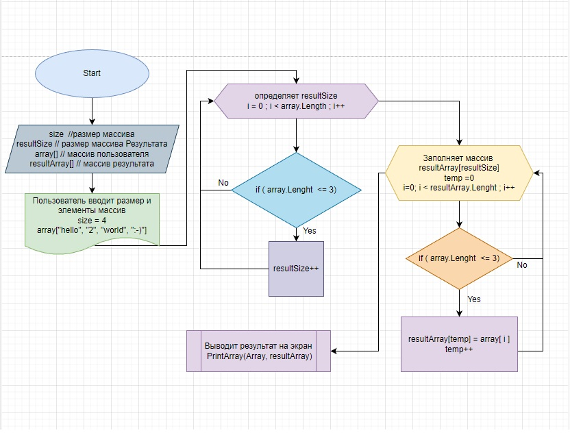

# Итоговая проверочная работа

## _Написать программу, которая из имеющегося массива строк формирует массив из строк, длинна которых меньше либо равна 3 символам. Первоначальный массив можно ввести с клавиатуры, либо задать на старте выполнения алгоритма. При решении не рекомендуется пользоваться коллекциями, лучше обойтись исключительно массивами._

#
## *Блок схема решения задания*

### _Пользователь вводит **размер** массива строк и **заполняет его значениями**. Определяется количество **строк равных или меньше 3х**. Создаётся массив необходимого **размера** и заполняется значениями строк **меньше или равных 3м символам**. Результат выводится на экран_.

## Описание алгоритма:

* Ввод данных пользователем.
* Определение размера **массива результата.**
* Заполнение **массива результата.**
* Вывод результата на экран.
